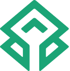

# Kedi Trees


<h1 align="center">
  <br>
  </a>
  <br>
  Kedi Trees
  <br>
</h1>


Keditree is a platform that enables business entities as well as individuals to invest in tree plantations and benefit carbon credits beside the monetary incentive. Carbon credits issued based on the amount of trees(existence) and the carbon sequestration capacity(effectiveness) are input to keditree DAO that mints tokens. DAO sets a fee in order to ensure there are tokens to be burnt in case of loss in value, ex: wildfire or etc.
Business entities and individuals can obtain a green pass to place their bids. The profile eases any audit requests for businesses in case they are interested in ESG scores.
The investors can trade their tokens on all DEXs and benefit the market dynamics.


## Table of Contents

- [Installation](#installation)
- [Technolohies](#technologies)
- [Usage](#usage)
- [Features](#features)
- [Contributing](#contributing)
- [License](#license)

## Installation

1. Clone the repository: `git clone git@github.com:HDehka/Keditrees.git`
2. Navigate to the project directory: `cd yourproject`
3. Install dependencies: `npm install`

## Technologies

- [**API3**](https://market.api3.org/dapis): API3 delivers a suite of products to developers building next-generation applications that have been designed to be simple to use. API3 is used to setup an airnode.
- [**Chainlink**](https://chain.link/): Chainlink connects the world to blockchains—enabling developers, startups, and enterprises to build tangible use cases that unlock real value in Web3. Chainlink oracles are used to transfer the real-world data realted to tree planting to our DAO.
- [**Ethereum Attestation Service (EAS)**](https://attest.sh/): EAS is an open-source public good for making attestations onchain or offchain about anything. The EAS is used to attest each carbon credit issued by the relevant authority.
- [**Foundry**](https://foundry.sh/): A tool for building and managing smart contracts.
- [**Linea**](https://docs.linea.build/): A JavaScript library for building user interfaces. Linea is used to deploy our smart contracts.
- [**Material-UI**](https://material-ui.com/): A popular React UI framework implementing Google's Material Design.
- [**React**](https://reactjs.org/): A JavaScript library for building user interfaces.
- [**Safe**](https://safe.global/): Safe brings digital ownership of accounts to everyone by building universal and open contract standards for the custody of digital assets, data, and identity. Safe is used to create a user-friendly wallet using social recovery. 
- [**Solidity**](https://docs.soliditylang.org/en/v0.8.23/): Solidity is an object-oriented, high-level language for implementing smart contracts.
- [**Scroll**](https://docs.scroll.io/en/home/): Scroll is a zero-knowledge rollup built to scale Ethereum. Our smart contracts are deployed on Scroll.
- [**Typescript**](https://www.typescriptlang.org/): TypeScript extends JavaScript by adding types to the language.
- [**UNICEF**](https://www.unicef.org/turkiye/en/conditional-cash-transfer-education-ccte-programme): UNICEF works in more than 190 countries and territories to reach the most disadvantaged children and adolescents. Our project responds to the use-case requirement of UNICEF which is to leverage Web3 technology creatively to address climate change, with a focus on practical solutions that combine Web3 modules with proven Web2 fundamentals.

## Usage

bash

```
npm start
```

## Features

Mock API for tree count analysis: https://api.jsonbin.io/v3/b/65587a6c54105e766fd1ba33

Chainlink Function Subscription Id: 1689 (Sepolia)

Deployed contracts:
- L1: https://sepolia.etherscan.io/address/0xaf88889772320d81f272a9d1e1af0552ed588636 
- Scroll: https://sepolia.scrollscan.com/address/0x994C3aCa08860d8B1a50A8076545eAA3fdfdEB0e
- Linea: https://goerli.lineascan.build/address/0x67873f3694Af60097980f920c62f39EeB5E05dD8

## Contracts

forge create --rpc-url https://sepolia.infura.io/v3/00000000000000000000000000000000 --private-key 0000000000000000000000000000000000000000000000000000000000000000 --etherscan-api-key 0000000000000000000000000000000000 --verify DaoKediTree

## Contributing

1. Fork the repository
2. Create a new branch: `git checkout -b feature/new-feature`
3. Make changes and commit: `git commit -m "Add new feature"`
4. Push to the branch: `git push origin feature/new-feature`
5. Submit a pull request

## License

This project is licensed under the [MIT License](LICENSE).

## Screenshots


## Documentation

